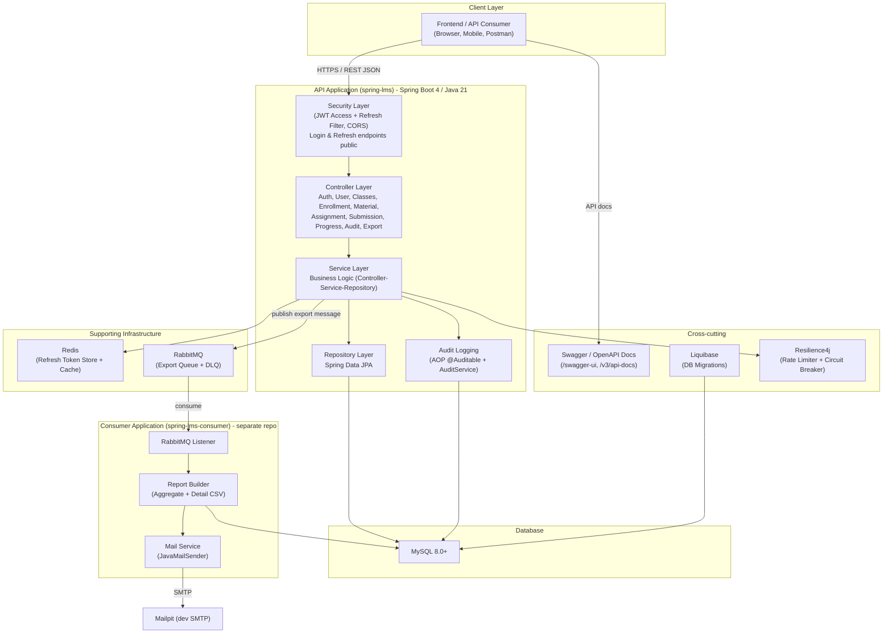
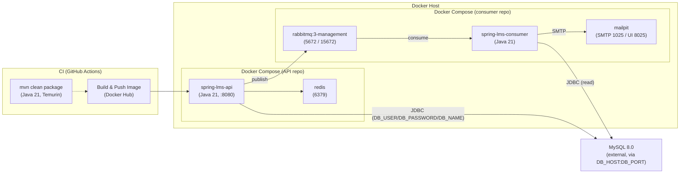
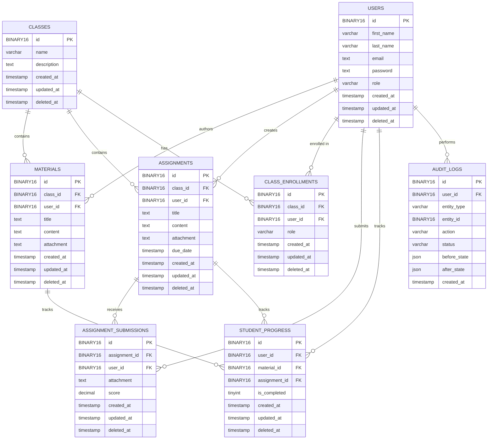

# Architecture

## 1. High-Level Architecture

The system is split into two applications sharing one MySQL database:

- **spring-lms (API)** — Spring Boot 4 / Java 21, serves all REST endpoints, writes the
  audit trail, and publishes progress-report export messages.
- **spring-lms-consumer (separate repo)** — consumes export messages, builds CSV reports,
  and emails them.



## 2. Deployment Architecture

The API runs as a Docker container; MySQL runs separately and is reached over the network
(connection settings via env vars). Redis runs alongside the API in its Compose project,
while RabbitMQ and Mailpit are defined in the consumer's own Compose file. GitHub Actions
builds and pushes the API image to Docker Hub on pushes to `main`. Both Compose projects
run on the same host network so the API can reach the consumer's RabbitMQ.



## 3. Entity Relationship Diagram



Note: `audit_logs.user_id` intentionally has **no `ON DELETE CASCADE`** — audit history is
preserved even when a user is deleted (unlike the other FKs which cascade).

### Audit Logs Actions
||

## 4. Feature Notes

### Audit Logs

- Generic append-only table; one row per action.
- Captured via **AOP** (`@Auditable(entityType, action, idExpr)`) for CRUD + **explicit
  calls** in `AuthService` (login / refresh / logout) and bulk operations
  (enroll / remove / progress).
- `before_state` / `after_state` are JSON snapshots of scalar entity fields only
  (associations are skipped to avoid lazy-loading issues).
- Persisted in a `REQUIRES_NEW` transaction so **failed** actions are recorded too.
- Actions: `create`, `update`, `delete`, `login`, `logout`, `refresh`, `export`.
- Viewing: `GET /api/audit-logs` and `GET /api/audit-logs/{id}` (ADMIN only, filterable).

### Auth: Access + Refresh Tokens

- Login returns `{ email, accessToken, refreshToken, expiresIn }`.
- Access token (`type=access`) is short-lived; refresh token (`type=refresh`) is long-lived
  and stored in Redis (`refresh:token:<jti>`) for revocation.
- `POST /api/auth/refresh` rotates the refresh token; `POST /api/auth/logout` revokes all
  of a user's refresh tokens (real logout for stateless JWTs).

### Event-Driven Progress Report Export

- `POST /api/class/{classId}/export` (ADMIN or teacher) publishes a `ProgressReportMessage`
  to RabbitMQ and returns `202 Queued` (audit `action=export` recorded).
- Publication is protected by a **Resilience4j circuit breaker** (`rabbitmq-publish`) with a
  fallback that surfaces a 5xx when the broker is unavailable.
- The **consumer service** (separate repo, see `docs/consumer-service.md`) builds a class
  progress report (aggregate summary + per-assignment/material detail), attaches
  `summary.csv` and `detail.csv`, emails it via Mailpit (dev) or a real SMTP, and routes
  failed messages to the dead-letter queue `progress.report.export.dlq`.

### Admin Bootstrap (manual)

No seed code. Promote a user to ADMIN via SQL:

```sql
UPDATE users SET role = 'ADMIN' WHERE email = '<your-admin-email>';
```
