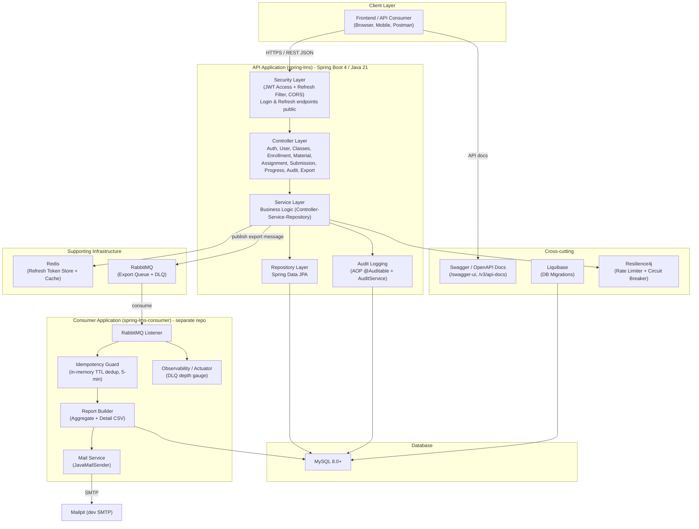
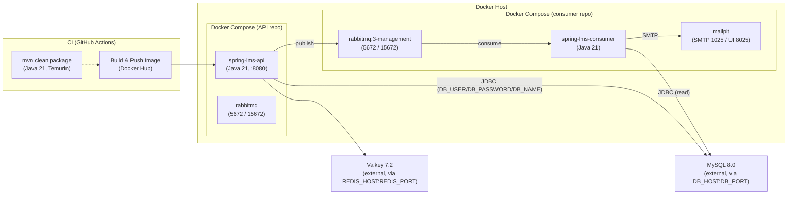

# Architecture

## 1. High-Level Architecture

The system is split into two applications sharing one MySQL database:

- **spring-lms (API)** — Spring Boot 4 / Java 21, serves all REST endpoints, writes the
  audit trail, and publishes progress-report export messages.
- **spring-lms-consumer (separate repo)** — consumes export messages, builds CSV reports,
  and emails them.



## 2. Deployment Architecture

The API runs as a Docker container; MySQL runs separately and is reached over the network
(connection settings via env vars). Valkey (Redis-compatible) runs alongside the API or
externally, while RabbitMQ and Mailpit are defined in the consumer's own Compose file.
GitHub Actions builds and pushes the API image to Docker Hub on pushes to `main`. Both
Compose projects run on the same host network so the API can reach the consumer's RabbitMQ.

The `docker-compose.yaml` ships with API + RabbitMQ only. MySQL and Valkey services are
commented out as optional — uncomment them if you don't have these running externally.
The consumer service (`spring-lms-consumer`) lives in a separate repository.



## 3. Entity Relationship Diagram


Note: `audit_logs.user_id` intentionally has **no `ON DELETE CASCADE`** — audit history is
preserved even when a user is deleted (unlike the other FKs which cascade).

Note: `users.password` is shown because it is part of the shared MySQL schema (the API writes it),
but the **consumer's** `User` entity does **not** map that column — the read-only consumer dropped
the `password` mapping (see `docs/consumer-service.md` §11).

### Audit Logs Actions

| Action | Description | Trigger |
| ------ | ----------- | ------- |
| `create` | Entity created | `@Auditable` on service create methods |
| `update` | Entity updated | `@Auditable` on service update methods |
| `delete` | Entity soft-deleted | `@Auditable` on service delete methods |
| `login` | User authenticated | `AuthService.login` (success + failure) |
| `logout` | User logged out | `AuthService.logout` |
| `refresh` | Token refreshed | `AuthService.refreshToken` |
| `export` | Progress report queued | `ClassesController.exportClassProgress` |

## 4. Feature Notes

### Audit Logs

- Generic append-only table; one row per action.
- Captured via **AOP** (`@Auditable(entityType, action, idExpr)`) for CRUD + **explicit
  calls** in `AuthService` (login / refresh / logout) and bulk operations
  (enroll / remove / progress).
- `before_state` / `after_state` are JSON snapshots of scalar entity fields only
  (associations are skipped to avoid lazy-loading issues).
- Persisted in a `REQUIRES_NEW` transaction so **failed** actions are recorded too.
- Actions: `create`, `update`, `delete`, `login`, `logout`, `refresh`, `export`.
- Viewing: `GET /api/audit-logs` and `GET /api/audit-logs/{id}` (ADMIN only, filterable).

### Auth: Access + Refresh Tokens

- Login returns `{ email, accessToken, refreshToken, expiresIn }`.
- Access token (`type=access`) is short-lived (30m default); refresh token (`type=refresh`)
  is long-lived (1d default) and stored in Redis/Valkey (`refresh:token:<jti>`) for
  revocation and rotation.
- **Refresh token rotation:** `POST /api/auth/refresh` issues a new access token AND rotates
  the refresh token — the old jti is deleted from Redis and a new one is stored. Reuse of a
  consumed refresh token is rejected as a revocation signal (security hardening, T22).
- `POST /api/auth/logout` revokes all of a user's refresh tokens (real logout for stateless
  JWTs).
- **Rate limiting:** auth endpoints (`login`, `refresh`) are protected by Resilience4j
  `@RateLimiter` — 100 requests per 60s window, 429 on excess (T3).
- **Active-user check:** the JWT filter validates the user still exists and is not soft-deleted
  on every request (T16).
- **JWT issuer verification:** tokens are validated against `requireIssuer("spring-lms-api")`
  on parse (T23).
- CORS is configured per-profile via `app.cors.allowed-origins` (T9).
- Swagger / API docs are gated to the `dev` profile only (T10).
- OSIV is disabled (`spring.jpa.open-in-view: false`); associations are eager-loaded via
  `@EntityGraph` / `JOIN FETCH` (T7).

### Event-Driven Progress Report Export

- `POST /api/class/{classId}/export` (ADMIN or teacher) publishes a `ProgressReportMessage`
  to RabbitMQ and returns `202 Queued` (audit `action=export` recorded).
- Publication is protected by a **Resilience4j circuit breaker** (`rabbitmq-publish`) with a
  fallback that surfaces a 5xx when the broker is unavailable.
- The **consumer service** (separate repo, see `docs/consumer-service.md`) builds a class
  progress report (aggregate summary + per-assignment/material detail), attaches
  `summary.csv` and `detail.csv`, emails it via Mailpit (dev) or a real SMTP, and routes
  failed messages to the dead-letter queue `progress.report.export.dlq`.
- **Resilience:** the protected work (build → CSV → mail) runs inside a Resilience4j circuit
  breaker (`report-export`); when OPEN/HALF_OPEN the message is **requeued** (deferred while SMTP
  is down), while permanent failures in CLOSED state are rejected to the DLQ. Validation stays
  outside the breaker so bad messages never trip it.
- **Idempotency:** an in-memory TTL guard (`ReportIdempotencyGuard`, 5-min) dedups redelivered
  messages keyed by `classId|recipientEmail|requestedAt`, so a crash-after-send doesn't resend
  the email. Lossy across restarts (accepted edge-case behavior).
- **Observability:** Spring Boot Actuator exposes `health`/`info`/`metrics`; a `rabbitmq.queue.messages`
  gauge tracks `progress.report.export.dlq` depth to alert on DLQ growth. The consumer runs as a
  **non-root** user in its container.
- **Message-level hardening:** recipient email is validated as a single `InternetAddress` before
  sending; CSV cells prefixed `= + - @` are neutralized against Excel formula injection.

### Admin Bootstrap (manual)

No seed code. Promote a user to ADMIN via SQL:

```sql
UPDATE users SET role = 'ADMIN' WHERE email = '<your-admin-email>';
```
